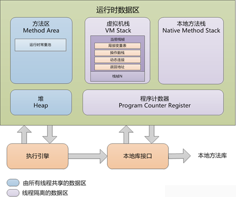

#JVM内存区域划分

####1. 虚拟机栈（JVM Stack）
*线程私有区域*，生命周期与线程相同。包含以下四个部分：  
1) 局部变量表：是一组变量值存储空间。用于存放方法参数和方法中定义的局部变量。局部变量表的空间在编译时完成分配。  
2) 操作数栈  
3) 动态链接  
4) 方法返回地址  

如果线程请求的栈深大于虚拟机所允许的深度，将抛出StackOverflowError异常（在函数递归调用时容易出现该异常）。如果虚拟机栈允许动态扩展，但在扩展时如无法申请足够的内存，则会跑出OutOfMemory异常。

####2. 程序计数器（Program Counter Register）
*线程私有区域*。当前线程执行字节码的行号指示器。

####3. 本地方法区（Native Method Stack）
*线程私有区域*。

####4. 堆（Heap）
*所有线程共享的一块内存区域*，在虚拟机启动时创建。该区域是用来存放所有对象实例和数组本身（数组引用存放在栈）。堆的大小由虚拟机启动时的参数-Xmx和-Xms控制。

####5. 方法区（Method Area）
*所有线程共享的一块内存区域*，用于存放被虚拟机加载的类信息，常量，静态变量，即时编译器编译后的代码等数据。在JVM规范里方法区被描述为堆的一个逻辑部分，但它却有一个别名叫做非堆（Non-Heap）。

运行时常量池（Runtime Constant Pool）方法区的一部分。  
常量池（Constant Pool），用于存放编译期生成的各种字面常量和符号引用，这部分信息将在类加载后进入方法区的运行时常量池中存放。

