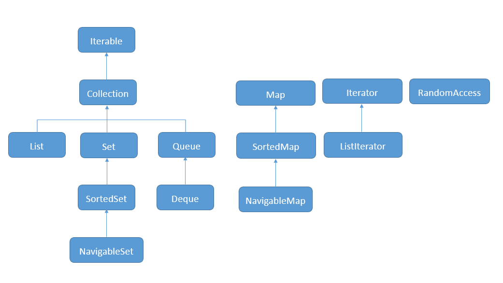

#### 集合框架的接口

#### Iterable和Iterator
1. Iterable接口定义遍历Collection的两种方式
2. Iterator接口定义遍历Collection的具体方法

#### 遍历Collection方式
1. forEach（Iterator）
2. stream（Spliterator）

#### 优先使用Iterator中的remove方法
1. 基于效率
2. 基于一致性（不会跑出ConcurrentModificationException）
