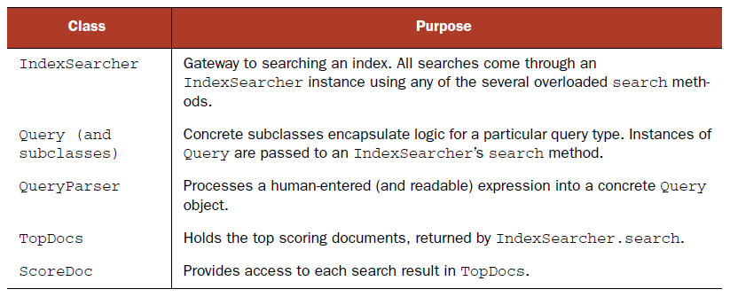
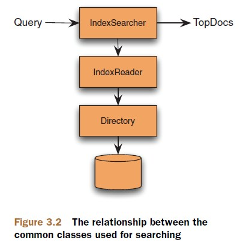

#Chapter3 Adding search to your app

####1. Lucene's primary searching API

####2. Using IndexSearcher
#####Create an IndexSearcher  
IndexReader does all the heavy lifting to open all index files and expose a low-level reader API, while IndexSeacher is a rather thin veneer.  
There are two approaches to create an IndexSearcher, one is to create the IndexSearcher from a directory, another is to create IndexSearcher from a IndexReader.  

 