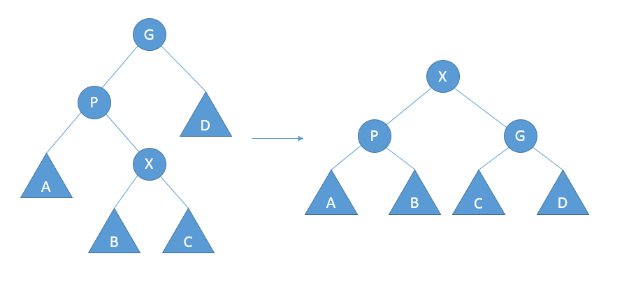
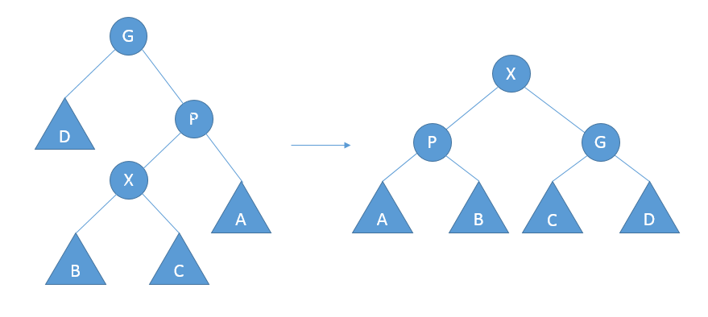
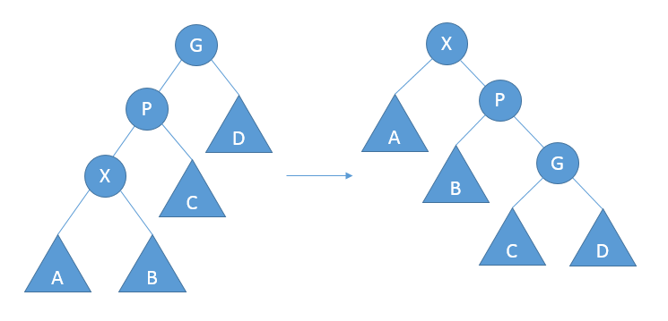
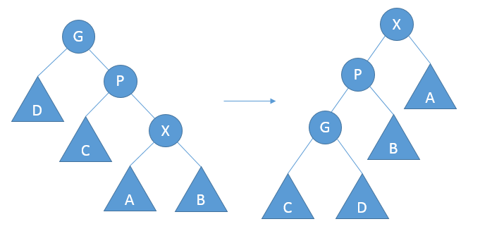

## 伸展树 (splay tree)

### 性质
伸展树保证从空树开始连续M次对树的操作最多花费O(MlogN)时间。
***

### 展开
将从底部沿着访问路径旋转。令X是在访问路径上的一个非根节点，如果X存在父节点P和祖父节点G，则存在两种情况以及对称情况
#### 之字形展开 (zig-zag)
* X为右儿子，P为左儿子

* X为左儿子，P为右儿子

#### 一字型展开 (zig-zig)
* X和P都为左儿子

* X和P都为右儿子

***
