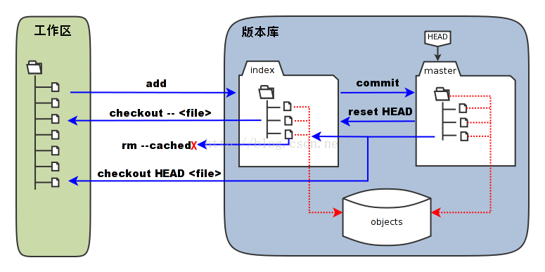

### 工作区，版本区，暂存区原理图


* 暂存区，被称为stage或index。

<<<<<<< HEAD
=======
### Git生成SSH key
ssh-keygen -t rsa -C "synico@qq.com"

```
docker pull 106.75.210.227:5000/hc-apm-web
```

https://software-download.microsoft.com/pr/Win10_1803_English_x64.iso?t=bf7abd20-9965-4bf9-a6df-81d1fbca585d&e=1528629855&h=a61b3411e1e03b4808a536f0b72b870d
>>>>>>> b6d48db5c4edd5ee8960c7305a2fb271ee3e8e86
